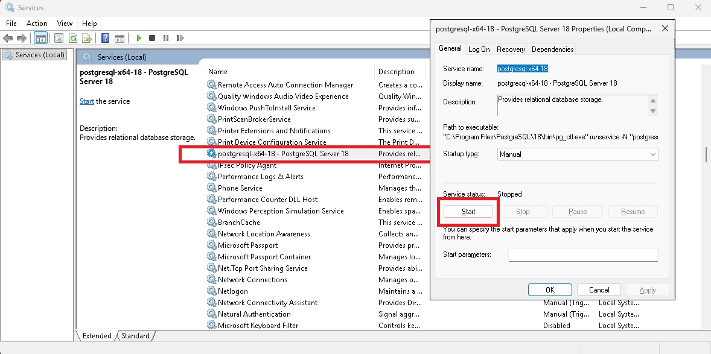

# API REST de Alumnos y Cursos — Express + PostgreSQL

Proyecto educativo de la materia **DAI** (ORT). Una API REST que hace CRUD de alumnos y cursos contra PostgreSQL, construida en **4 versiones incrementales** para que veas cómo se refactoriza código paso a paso: desde un solo archivo con todo adentro, hasta una arquitectura en capas con clases intercambiables de acceso a datos.

---

## 🗂️ Estructura del proyecto

```
src/
├── server.js                   ← Arquitectura en capas (controller/service/repository)
├── controllers/                ← Reciben el request HTTP, llaman al service, responden
│   ├── alumnos-controller.js
│   ├── cursos-controller.js
│   ├── materias-controller.js
│   └── calificaciones-controller.js
├── services/                   ← Lógica de negocio (calcular edad, validar curso)
│   ├── alumnos-service.js
│   ├── materias-service.js
│   ├── calificaciones-service.js
│   └── cursos-service.js
├── repositories/               ← Acceso a datos (SQL puro)
│   ├── alumnos-repository-new.js   ← Refactorizada (usa DbPg)
│   ├── cursos-repository-new.js    ← Refactorizada (usa DbPg)
│   ├── materias-repository-new.js    ← Refactorizada (usa DbPg)
│   ├── calificaciones-repository-new.js    ← Refactorizada (usa DbPg)
│   ├── db-pg.js                    ← Clase helper para PostgreSQL
│   └── db-mssql.js                 ← Clase helper para SQL Server
├── entities/                   ← Clases que representan las tablas
│   ├── alumno.js
│   ├── materias.js
│   ├── calificaciones.js
│   └── curso.js
├── configs/
│   └── db-config.js            ← Configuración de conexión a PostgreSQL
└── helpers/
    └── log-helper.js           ← Logueo de errores a archivo y/o consola
```

---

## 🚀 Cómo arrancar

### 1. Tener PostgreSQL corriendo

En Windows, el servicio de PostgreSQL tiene que estar iniciado. Si no arranca, abrí **Servicios** (`services.msc`), buscá `postgresql-x64-18` y dale **Start**:



### 2. Crear la base de datos y cargar datos

Abrí **pgAdmin** o cualquier cliente de PostgreSQL y ejecutá el script:

```
documents/database/script-postgress.sql
```

Este archivo crea las tablas `cursos` y `alumnos`, y las llena con datos de ejemplo (135 alumnos repartidos en 5 cursos).

### 3. Configurar la conexión

Copiá `.env-template` como `.env` y completá con tus datos locales:

```env
DB_HOST       = "localhost"
DB_DATABASE   = "DAI"
DB_USER       = "postgres"
DB_PASSWORD   = "root"
DB_PORT       = 5432
PORT          = 3000
```

### 4. Instalar dependencias y ejecutar

```bash
npm i #npm install
npm run generat-token #Copia el token que devuelve
npm run server
```

### 5. Probar con Postman

Importá la colección de Postman que está en:

```
documents/postman/DAI - PG - Alumnos-cursos.postman_collection.json
```

Tiene requests para todos los endpoints, incluyendo casos de error (404, 400). Como usamos verificación JWT se debe colocar en la pestaña "Authorization" el token copiado previamente.

---

## 🌐 Endpoints

Tanto `alumnos` como `cursos` siguen el mismo patrón CRUD:

| Método | Ruta | Descripción | Status |
|--------|------|-------------|--------|
| GET | `/api/alumnos` | Listar todos los alumnos | 200 |
| GET | `/api/alumnos/:id` | Obtener un alumno por ID | 200 / 404 |
| POST | `/api/alumnos` | Crear un alumno (body JSON) | 201 / 400 |
| PUT | `/api/alumnos/:id` | Modificar un alumno | 200 / 404 |
| DELETE | `/api/alumnos/:id` | Eliminar un alumno | 200 / 404 |
| GET | `/api/alumnos/test-insert` | Ejemplo: crear un alumno desde código | 201 |

Lo mismo para `/api/cursos` (sin el `test-insert`).

---

### Tablas

| Tabla | Columnas |
|-------|----------|
| `cursos` | `id` (SERIAL PK), `nombre` |
| `alumnos` | `id` (SERIAL PK), `nombre`, `apellido`, `id_curso` (FK → cursos), `fecha_nacimiento`, `hace_deportes` |

### Scripts

| Archivo | Qué hace |
|---------|----------|
| `documents/database/script-postgress.sql` | Crea las tablas e inserta 5 cursos + 135 alumnos |
| `documents/database/alumnos.json` | Los 135 alumnos en formato JSON (fuente de verdad de los INSERTs) |

---

## 🧪 Postman

La colección para probar la API está en:

```
documents/postman/DAI - PG - Alumnos-cursos.postman_collection.json
```

Incluye requests para todos los endpoints con ejemplos de happy path y casos de error.

---

## 📦 Dependencias

```bash
npm install express         # framework web
npm install cors            # habilitar CORS
npm install pg              # driver PostgreSQL
npm install dotenv          # variables de entorno desde .env
npm install http-status-codes  # constantes legibles (StatusCodes.OK vs 200)
npm install nodemon --save-dev # reinicio automático en desarrollo
```
